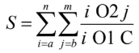

# Протокол лабораторної роботи №1
**Дисципліна:** Програмування. Частина 2

---

## Загальна інформація
* **Номер роботи:** 1
* **Тема:** Основні типи та оператори мови програмування Java
* **Студентка:** Огій Ірина Вадимівна
* **Група:** ІО-з51

---

## Розрахунок варіанта
Згідно з методичними вказівками, параметри завдання визначаються на основі порядкового номера студента у списку групи (№7) за допомогою операції остачі від ділення.

| Параметр | Формула | Результат | Значення для реалізації |
| :--- | :--- | :--- | :--- |
| **C2** (Операція O1) | $7 \mod 2$ | **1** | Операція у знаменнику: **віднімання (-)** |
| **C3** (Константа C) | $7 \mod 3$ | **1** | Константа $C$ у знаменнику дорівнює **1** |
| **C5** (Операція O2) | $7 \mod 5$ | **2** | Операція у чисельнику: **остача від ділення (%)** |
| **C7** (Тип індексів) | $7 \mod 7$ | **0** | Тип ітераторів $i$ та $j$: **byte** |

**Підсумкова аналітична формула функції:**

---

## Завдання
Обчислити значення подвійної суми за заданою формулою, де параметри та типи даних визначені розрахованим варіантом №7. Результатом виконання дій є єдине значення дійсного типу. Програма має коректно обробляти всі виключні ситуації, що можуть виникнути під час виконання коду.

---

## Опис виконаної роботи

У ході виконання роботи було реалізовано наступні програмні та алгоритмічні рішення:

1. **Специфікація типів даних та збереження точності:**
   * Відповідно до коефіцієнта $C7=0$, для змінних меж (`a`, `n`, `b`, `m`) та ітераторів циклів (`i`, `j`) використано примітивний 8-бітний цілочисельний тип **`byte`**.
   * Оскільки результатами арифметичних дій є дійсні числа, для накопичення фінальної суми використано тип **`double`**. Під час розрахунку частки застосовано явне приведення чисельника до типу `(double)`, що відокремлює дробову частину від цілочисельного ділення.

2. **Структура керуючих конструкцій:**
   * Обчислення подвійної суми реалізовано через **вкладену конструкцію циклів `for`** типу `byte`. Зовнішній цикл ітерується по параметру $i$ (від $a$ до $n$), а внутрішній - по параметру $j$ (від $b$ до $m$).

3. **Захист від виключних ситуацій (Runtime Errors):**
   * **Ділення на нуль у знаменнику:** Оскільки константа $C=1$, при значенні $i=1$ вираз $(i - 1)$ призводить до ділення на нуль. Для запобігання помилці `ArithmeticException` впроваджено логічний блок `if (i == 1)`. У разі істинності умови, програма виводить попередження в консоль та використовує оператор `continue` для безпечного переходу до наступної ітерації.
   * **Ділення за модулем у чисельнику:** Додатково реалізовано перевірку умови `if (j == 0)`, яка страхує програму від помилки ділення за модулем на нуль, якщо нижня межа $b$ набуде нульового значення.

4. **Дотримання стандартів кодування:**
   * Структура програми відповідає вимогам **Google Java Style Guide**. Усі ідентифікатори змінних та текстові повідомлення консольного інтерфейсу виконані англійською мовою (`totalSum`, `term`), тоді як пояснювальні коментарі до логічних блоків написані українською мовою.

---

## Результати
Програма стабільно та коректно обчислює дійсне значення суми для довільних заданих меж. Впроваджений механізм подвійної валідації знаменників (для ітераторів $i$ та $j$) робить додаток стійким до некоректних вхідних даних та відображає підсумкове значення суми $S$ у консолі з точністю до 4 знаків після коми за допомогою методу `printf`.

---

## Висновки
Під час виконання лабораторної роботи я ознайомилася з базовим синтаксисом Java, арифметичними операторами та принципами роботи ітераційних циклів. Я навчилася реалізовувати алгоритми з вкладеною логікою, застосовувати явне приведення типів даних (`byte` до `double`) для збереження точності обчислень, а також програмно обробляти критичні помилки часу виконання (Runtime Errors), такі як ділення на нуль.

---
## 📺 Відео-захист лабораторної роботи
Клацніть на зображення нижче, щоб переглянути відео-захист цієї роботи:

